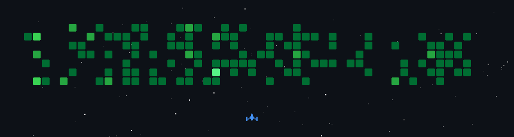

# ⚡ Hi, I'm Richard
### **AI Product Engineer | PhD Scholar @ IIT Jodhpur**

---

## 📌 About Me

I design and build production-ready software. My focus is on end-to-end product development—combining robust backend systems, modern web architectures, data engineering, and Large Language Models (LLMs) to solve complex, real-world problems.

---

## ⚡ Impact at a Glance

|  Experience |  Projects |  Research |  Patents |
| :---: | :---: | :---: | :---: |
| **1+ Years** | **10+ Production Apps** | **1 AIED Paper** | **1 Patent Filed** |

- **Focus:** Scalable AI Systems, Backend Infrastructure, Production LLM Architectures

---

##  Currently Working On

-  **Building:** AI-powered educational tools tailored for personalized learning
-  **Pursuing:** PhD in Computer Science at **IIT Jodhpur**
-  **Deepening:** Expertise in **GCP** cloud infrastructure and **LLM Orchestration (RAG)**

---

##  Research & Innovations

###  Peer-Reviewed Publication
> **[Who Do Learners Ask for Help? Modeling Social Role Diversity in Agentic AI for Educational Help-Seeking](https://github.com)**  
> *Published in AIED (Artificial Intelligence in Education)*  
> Explores multi-agent LLM systems designed to optimize help-seeking behaviors and dynamic feedback in digital learning environments.

###  Patent
> **Automated Medication Dispenser System**  
> *Medication Dispenser System with Modular Design and Prescription Synchronization via Mobile Application*  
> **Application No:** `202511116788` | **Filed:** November 2025

---

##  Featured Projects

<table>
  <tr>
    <td width="50%">
      <h3> Healthcare Platform</h3>
      
A comprehensive healthcare system built to manage patient workflows, medical histories, and real-time tele-consultations securely and at scale.

      
<b>Tech:</b> <code>Python</code> <code>Django</code> <code>PostgreSQL</code> <code>Docker</code> <code>React</code>

      <a href="https://github.com/ritchi-e/neo-progress-tracker"><b>🔗 View Repository »</b></a>
    </td>
    <td width="50%">
      <h3> AI Exam & Evaluation Platform</h3>
      
An automated evaluation system leveraging LLMs to evaluate subjective open-ended student responses with actionable rubric-driven feedback.

      
<b>Tech:</b> <code>Python</code> <code>FastAPI</code> <code>OpenAI API</code> <code>LangChain</code> <code>Next.js</code>

      <a href="#"><b>🔗 View Repository »</b></a>
    </td>
  </tr>
  <tr>
    <td width="50%">
      <h3> Production RAG Chatbot</h3>
      
An enterprise-grade Retrieval-Augmented Generation agent capable of searching dynamic internal knowledge bases with strict hallucination guardrails.

      
<b>Tech:</b> <code>Python</code> <code>Qdrant/Pinecone</code> <code>LangChain</code> <code>FastAPI</code> <code>React</code>

      <a href="#"><b>🔗 View Repository »</b></a>
    </td>
    <td width="50%">
      <h3> Flight Data Analytics Pipeline</h3>
      
An end-to-end data processing pipeline for aggregating, cleaning, and visualizing real-time flight metrics to identify operational bottlenecks.

      
<b>Tech:</b> <code>Python</code> <code>Pandas</code> <code>SQLite</code> <code>Docker</code> <code>Data Viz</code>

      <a href="#"><b>🔗 View Repository »</b></a>
    </td>
  </tr>
</table>

---

##  Tech Stack

---

##  GitHub Activity Game

  

---

###  Let's Connect!

